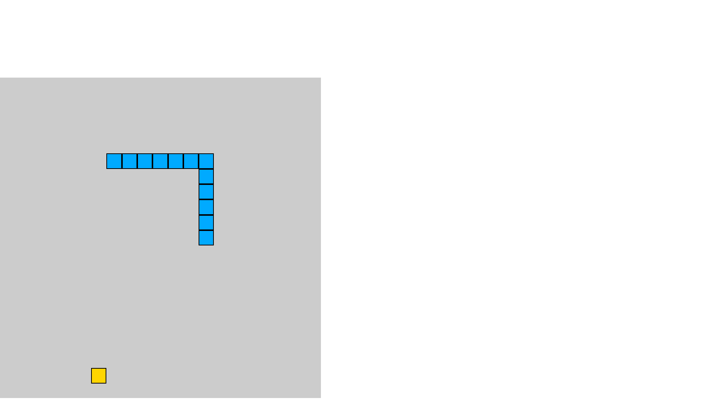

## Javascript-Snake-Game (vanilla javascript)

`requestAnimationFrame`, `window 함수`, `grid layout` 등을 이용한 실습

`requestAnimationFrame`는 처음 사용해보는거라 이해하기 힘들었지만 여러번 사용해보면 뭐든지 된다.

`grid layout`은 CSS 실습때 배우고 어디에 쓸까 했는데 이 실습에서는 필수적이였던 것 같다.

앞으로도 배운 것들을 많이 적용해보자.

#### [video tutorial](https://www.youtube.com/watch?v=QTcIXok9wNY&feature=youtu.be).
